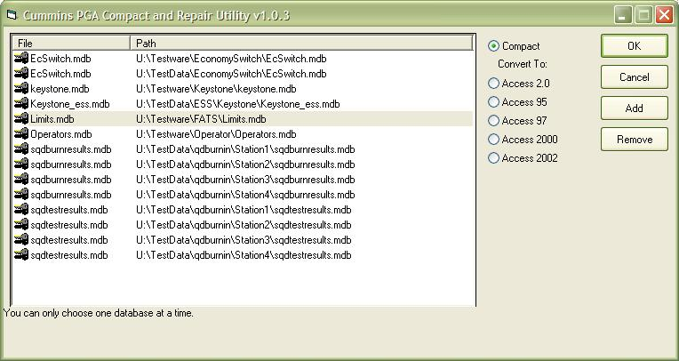



## Database Compact/Conversion Utility

### Description

I created this for work to maintain a list of databases that we have for different product lines. It uses the Access 10 Object Library to perform this functionality "behind the scenes", so to speak. By doing it this way, you should notice a vast performance increase. NOTE: If you do not have Access 2002, this will not work for you unless you have msacc.olb registered on your system, but there are other options that work in much the same way.
 
### More Info
 

             |
---                |---
**Submitted On**   |2004-11-23 17:00:12
**By**             |[james kahl](https://github.com/Planet-Source-Code/PSCIndex/blob/master/ByAuthor/james-kahl.md)
**Level**          |Beginner
**User Rating**    |4.8 (19 globes from 4 users)
**Compatibility**  |VB 6\.0
**Category**       |[Databases/ Data Access/ DAO/ ADO](https://github.com/Planet-Source-Code/PSCIndex/blob/master/ByCategory/databases-data-access-dao-ado__1-6.md)
**World**          |[Visual Basic](https://github.com/Planet-Source-Code/PSCIndex/blob/master/ByWorld/visual-basic.md)
**Archive File**   |[Database\_C18212311232004\.zip](https://github.com/Planet-Source-Code/james-kahl-database-compact-conversion-utility__1-57391/archive/master.zip)

